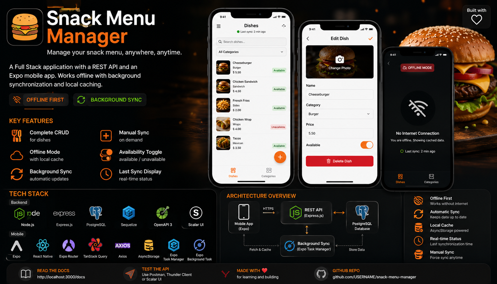

<p align="center">
  
</p>
# 🍔 Snack Menu Manager

A **Full Stack** application that allows snack owners to manage their menu through a REST API and an Expo mobile application.

The application continues to work even without an Internet connection thanks to **background synchronization** and **local caching**.

---

# 📖 Overview

This project was developed as part of a learning program.

Its goal is to provide a complete solution for snack owners to easily manage their menu from a mobile application.

The project consists of two parts:

* **Backend:** REST API built with Express and PostgreSQL.
* **Mobile:** Expo application powered by TanStack Query with background synchronization.

The main focus of this project is:

* Clean architecture
* API documentation
* Data caching
* Offline support
* Automatic background synchronization

---

# ✨ Features

## Backend

* Complete CRUD operations for menu items
* Data validation
* Error handling
* OpenAPI documentation
* Scalar UI integration
* PostgreSQL database using Sequelize ORM

## Mobile

* Display all menu items
* Add a new dish
* Edit an existing dish
* Delete a dish
* Toggle dish availability
* Manual synchronization
* Automatic background synchronization
* Local caching with AsyncStorage
* Offline mode
* Display the last synchronization time

---

# 🛠 Tech Stack

## Backend

* Node.js
* Express.js
* PostgreSQL
* Sequelize ORM
* OpenAPI 3
* Scalar API Reference

## Mobile

* React Native
* Expo
* Expo Router
* Axios
* TanStack Query
* Expo Task Manager
* Expo Background Task
* AsyncStorage

---

# 📂 Project Structure

```text
snack-menu-manager/
│
├── backend/
│   ├── src/
│   │   ├── config/
│   │   ├── controllers/
│   │   ├── middleware/
│   │   ├── models/
│   │   ├── routes/
│   │   ├── services/
│   │   ├── docs/
│   │   ├── app.js
│   │   └── server.js
│   │
│   ├── package.json
│   └── README.md
│
├── mobile/
│   ├── app/
│   ├── components/
│   ├── hooks/
│   ├── services/
│   ├── storage/
│   ├── tasks/
│   ├── constants/
│   ├── package.json
│   └── README.md
│
└── README.md
```

---

# 🗄 Database Schema

Table: **dishes**

| Column     | Type               |
| ---------- | ------------------ |
| id         | SERIAL PRIMARY KEY |
| name       | VARCHAR(100)       |
| price      | NUMERIC(6,2)       |
| category   | VARCHAR(50)        |
| available  | BOOLEAN            |
| created_at | TIMESTAMP          |

---

# 🚀 REST API

| Method | Endpoint       | Description            |
| ------ | -------------- | ---------------------- |
| GET    | /api/plats     | Retrieve all dishes    |
| GET    | /api/plats/:id | Retrieve a single dish |
| POST   | /api/plats     | Create a new dish      |
| PUT    | /api/plats/:id | Update a dish          |
| DELETE | /api/plats/:id | Delete a dish          |

---

# 📚 API Documentation

Interactive API documentation is available using **Scalar UI**.

```text
http://localhost:3000/docs
```

The documentation includes:

* Endpoint descriptions
* Parameters
* Request bodies
* Response examples
* HTTP status codes
* Usage examples

---

# 🔄 Background Synchronization

The core feature of this project is a background synchronization task.

How it works:

1. Expo Task Manager registers a background task.
2. Expo Background Task schedules its execution based on the operating system.
3. The application fetches the latest menu from the REST API.
4. The retrieved data is stored in AsyncStorage.
5. The synchronization timestamp is saved.
6. If the network is unavailable, cached data is loaded instead.
7. Users can also trigger synchronization manually.

---

# 📱 Offline Mode

Whenever the server or Internet connection is unavailable:

* Data is loaded from AsyncStorage.
* A banner informs the user that the application is running in offline mode.
* The last successful synchronization time is displayed.

---

# ⚙️ Installation

## 1. Clone the Repository

```bash
https://github.com/Ouhfi/Snack-Menu-Manager.git
```

---

## 2. Backend

```bash
cd backend

npm install

cp .env.example .env

npm run dev
```

---

## 3. Mobile

```bash
cd mobile

npm install

npx expo start
```

---

# 🔑 Environment Variables

Backend

```env
PORT=3000

DB_HOST=localhost
DB_PORT=5432
DB_NAME=snack_db
DB_USER=postgres
DB_PASSWORD=password
```

---

# 📸 Screenshots

Add screenshots of:

* Menu List
* Add/Edit Dish Form
* Offline Mode
* Scalar API Documentation
* Last Synchronization Status

---

# 🧪 Testing

The backend API can be tested using:

* Postman
* Thunder Client
* Scalar UI

---

# 💡 Bonus Features

* Local notifications after synchronization
* Pull-to-refresh
* Optimistic updates
* Category filtering
* Search functionality
* Network connectivity detection
* Pagination

---

# 👨‍💻 Author

**Marouane Ouhfid**

Full Stack Developer

**GitHub:** https://github.com/Ouhfi

**LinkedIn:** https://www.linkedin.com/in/marouan-ouhfid-a6b132237

---

# 📄 License

This project was developed for educational purposes.

Feel free to use it for learning and personal development.

